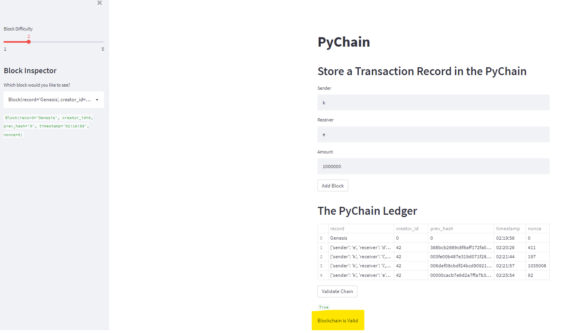

# Build_Blockchain_Ledger

The pychain builds a blockchain-based ledger system, complete with a user-friendly web interface. This ledger allows partner banks to conduct financial transactions and to verify the integrity of the data in the ledger.


## Technologies

This project leverages python 3.7 with the following packages:


* [pandas](https://pandas.pydata.org/pandas-docs/stable/index.html) - For Series, DataFrame, and plots

* [streamlit](https://docs.streamlit.io/library/get-started) - For deploying data apps

* [dataclasses](https://docs.python.org/3/library/dataclasses.html) - For decorator and functions for automatically adding generated special methods such as __init__() and __repr__() to user-defined classes

* [typing](https://docs.python.org/3/library/typing.html) - For runtime support for type hints.

* [datetime](https://docs.python.org/3/library/datetime.html) - For manipulating dates and times.

* [hashlib](https://docs.python.org/3/library/hashlib.html) - For common interface to many different secure hash and message digest algorithms.


## Installation Guide

Before running the application first install the following dependencies.

```python
  pip install pandas
  pip install streamlit
```


## Usage

To use the pychain, simply clone the `pychain' from the respository, open CLI and run **pychain.py** with:

```python
streamlit run pychain.py
```

Here is a screenshot of pychain app.



## Contributors

Brought to you by FinTech Material and Eunice

---

## License

MIT